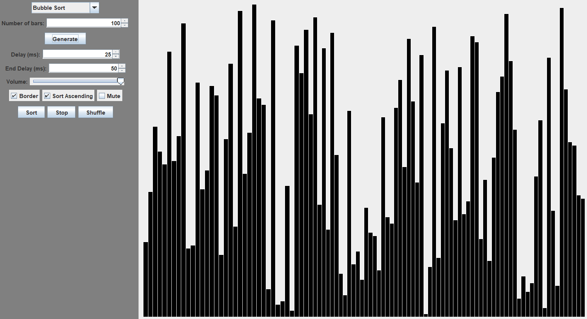

# Sorting Algorithm Visualiser

Welcome to the **Sorting Algorithm Visualiser**! This Java-based project allows you to visualize several different sorting algorithms in both Command Line Interface (**CLI**) and Graphical User Interface (**GUI**) modes.



## Table of Contents

- [Installation](#installation)
- [Usage](#usage)
  - [Running The Program](#running-the-program)
  - [CLI Mode](#cli-mode)
  - [GUI Mode](#gui-mode)
- [Sorting Algorithms](#sorting-algorithms)
  - [Bubble Sort](#bubble-sort)
  - [Selection Sort](#selection-sort)
  - [Insertion Sort](#insertion-sort)
  - [Cocktail Shaker Sort](#cocktail-shaker-sort)
  - [Quick Sort](#quick-sort)
  - [Merge Sort](#merge-sort)
  - [Bogo Sort](#bogo-sort)
  - [Stalin Sort](#stalin-sort)
- [License](#license)
- [See Also](#see-also)
- [:)](#happy-sorting-d)

## Installation

Before you proceed with installation, ensure you have the following prerequisites:

- [Git](https://git-scm.com/downloads) (to download the project)
- [JDK 21](https://www.oracle.com/java/technologies/downloads/#jdk21) (to build the software)

Follow these steps to install the software:

1. Clone the repository using Git:

    ```bash
    git clone https://github.com/ricardoholmes/sorting-algorithm-visualiser/
    ```

2. Navigate into the project's folder:

    ```bash
    cd sorting-algorithm-visualiser
    ```

3. There are multiple installation options available:

    - To assemble the project into an executable JAR file, use the following command:

        ```bash
        ./gradlew jar
        ```

        The JAR file will be located in `app/build/libs/`.

    - To install the program directly, use:

        ```bash
        ./gradlew installDist
        ```

        The installation will be in `app/build/install/`.

    - To assemble the project and generate ZIP and TAR files containing it, use:

        ```bash
        ./gradlew assemble
        ```

        The distribution files will be in `app/build/distributions/`.  \
        Additionally, a JAR file will be created in `app/build/libs/`.

## Usage

### Running The Program

[Java](https://www.java.com/en/download/) is required in order to run the software. After installing, follow these instructions:

- **Batch File (Windows)**: If you are using Windows, you can run the software by double clicking the file or through terminal (CMD or PowerShell).

    ```bash
    ./sorting-algorithm-visualiser.bat [OPTION]
    ```

- **Binary File (All Platforms)**: The binary file is platform-independent and can be run on all platforms.

    ```bash
    ./sorting-algorithm-visualiser [OPTION]
    ```

- **JAR File**: Also platform independent, but all in one file.

    ```bash
    java -jar ./sorting-algorithm-visualiser.jar [OPTION]
    ```

- Replace `[OPTION]` with one of the following options:
  - `-h`: List all available options.
  - `-cli`: Launch in CLI mode.
  - `-gui`: Launch in GUI mode.
  - Nothing: If both modes are supported by your device, you will be prompted to choose between them. Otherwise, it will automatically launch in the mode that your device supports.

### CLI Mode

In **CLI mode**, follow these steps:

1. Choose a sorting algorithm.
2. Specify the size of the list to be sorted.
3. Set the delay between numbers moving positions.
4. Choose between ascending or descending order.

The program will then show the list as it's being sorted.

### GUI Mode

In **GUI mode**, the window is divided into two panels:

- **Options Panel**
  - Choose a sorting algorithm from a drop-down list.
  - Select the number of bars.
  - Set delays between numbers moving positions and elements turning green.
  - Adjust the volume.
  - Toggle bar borders.
  - Choose sorting order (ascending/descending).
  - Mute sounds.
  - Shuffle the list.
- **Bars Panel**
  - Displays the bars in real-time as they are being sorted.

The options section also lets you start and stop the sorting process.

## Sorting Algorithms

The algorithms currently included in the software are listed below.

Feel free to explore and visualize them to gain a better understanding of how they work (or to listen to the cool sounds that they make)!

### **Bubble Sort**

A simple sorting algorithm that repeatedly steps through the list, compares adjacent elements, and swaps them if they are in the wrong order.

### **Selection Sort**

A straightforward sorting algorithm that divides the input list into two parts: the sorted part and the unsorted part. It repeatedly selects the smallest (or largest) element from the unsorted part and moves it to the end of the sorted part.

### **Insertion Sort**

This algorithm builds a sorted array one item at a time. It takes one element from the input data and inserts it into the correct position within the already sorted part of the array.

### **Cocktail Shaker Sort**

Also known as bidirectional bubble sort, this algorithm is a variation of the bubble sort that sorts in both directions.

### **Quick Sort**

A divide-and-conquer sorting algorithm that works by selecting a 'pivot' element from the array and partitioning the other elements into two sub-arrays according to whether they are less than or greater than the pivot.

### **Merge Sort**

Another divide-and-conquer algorithm that divides the input array into two halves, recursively sorts them, and then merges the two sorted halves to produce a single sorted output.

### **Bogo Sort**

A highly ineffective sorting algorithm that randomises the order of the list until it is sorted.

### **Stalin Sort**

An esoteric sorting algorithm that removes elements that are out of order, leaving only the sorted elements in the list.

## License

This project is licensed under the MIT License - see [LICENSE](LICENSE) for more details.

## See Also

[Sound of Sorting](https://panthema.net/2013/sound-of-sorting/) \
[15 Sorting Algorithms in 6 Minutes](https://youtu.be/kPRA0W1kECg)

---

### ***Happy Sorting!* :D**
